# Computational Workflows Guide for AI Systems

## Overview

This repository contains **two main computational components**:

1. **Python-based heterogeneous agent models** (`Code/HA-Models/`)
2. **Stata-based empirical analysis** (`Code/Empirical/`)

The computational pipeline implements **5 sequential steps**. See [timing estimates](../reproduce/benchmarks/README.md) for hardware-specific duration data.

## Computational Pipeline Diagram

```mermaid
flowchart TD
    subgraph "Step 1: Splurge Estimation"
        A[Estimation_BetaNablaSplurge.py] --> A1[Figure 1]
        A --> A2[Splurge factor ς = 0.249]
    end
    
    subgraph "Step 2: Discount Factor Estimation"
        B[EstimAggFiscalMAIN.py] --> B1[Figure 2: Lifecycle profiles]
        B --> B2[Figure 3: iMPC responses]
        B --> B3[β distributions by education]
    end
    
    subgraph "Step 3: Robustness - Optional"
        C[EstimAggFiscalMAIN.py with Splurge=0]
        C --> C1[Online Appendix results]
    end
    
    subgraph "Step 4: HANK Model"
        D1[HA-Fiscal-HANK-SAM.py] --> D2[Jacobian matrices]
        D2 --> D3[HA-Fiscal-HANK-SAM-to-python.py]
        D3 --> D4[Figure 5: HANK comparisons]
    end
    
    subgraph "Step 5: Policy Comparison"
        E[AggFiscalMAIN.py] --> E1[Figure 4: Policy effects]
        E --> E2[Figure 6: Welfare comparisons]
        E --> E3[Tables 6-8: Multipliers & Welfare]
    end
    
    A2 --> B
    B3 --> C
    B3 --> D1
    B3 --> E
    D4 --> E2
    
    style A fill:#90EE90
    style B fill:#FFB347
    style C fill:#D3D3D3
    style D1 fill:#87CEEB
    style E fill:#FF6B6B
```



**Legend**: 🟢 Fast (~20 min) | 🟠 Long (~21 hrs) | ⚪ Optional | 🔵 Medium (~1 hr) | 🔴 Very Long (~65 hrs)

## Main Computational Entry Point

### `Code/HA-Models/do_all.py` - Master Control Script

This is the **primary entry point** for all computational work:

```python
# Control panel - Configure which steps to run:
run_step_1 = True   # Splurge factor estimation (~20 min)
run_step_2 = True   # Discount factor estimation (~21 hours!)  
run_step_3 = False  # Robustness results (similar to step 2)
run_step_4 = True   # HANK model (~1 hour)
run_step_5 = True   # Policy comparison (~65 hours!)
```

**Usage for AI Systems**:

```bash
cd Code/HA-Models
python do_all.py  # Runs all enabled steps sequentially
```

## Step-by-Step Computational Workflow

### Step 1: Splurge Factor Estimation (~20 minutes)

- **File**: `Target_AggMPCX_LiquWealth/Estimation_BetaNablaSplurge.py`
- **Purpose**: Replicates Section 3.1 of paper
- **Output**:
  - Figure 1 → `Target_AggMPCX_LiquWealth/Figures/`
  - Results → `Target_AggMPCX_LiquWealth/*.txt`
- **AI Note**: Fast step, good for testing environment

### Step 2: Baseline Results (~21 hours) ⚠️ **COMPUTATIONALLY INTENSIVE**

- **Files**:
  - `FromPandemicCode/EstimAggFiscalMAIN.py`
  - `FromPandemicCode/CreateLPfig.py`
  - `FromPandemicCode/CreateIMPCfig.py`
- **Purpose**: Estimate discount factor distributions (Section 3.3.3)
- **Output**: Figure 2, baseline model results
- **AI Warning**: This is the most time-intensive step (~7 hours per education group × 3 groups)

### Step 3: Robustness Results (~21 hours) **[OPTIONAL - DEFAULT OFF]**

- **File**: `FromPandemicCode/EstimAggFiscalMAIN.py` (with different parameters)
- **Purpose**: Robustness check with Splurge = 0 (Online Appendix)
- **Parameters**: `[R=1.01, CRRA=2.0, ReplRate_w_benefits=0.7, ReplRate_wo_benefits=0.5, Splurge=0]`
- **AI Note**: Disabled by default to save computation time

### Step 4: HANK Model (~1 hour)

- **Files**:
  - `FromPandemicCode/HA-Fiscal-HANK-SAM.py` (household Jacobians)
  - `FromPandemicCode/HA-Fiscal-HANK-SAM-to-python.py` (HANK experiments)
- **Purpose**: Section 5 robustness check, creates Figure 5
- **AI Note**: Relatively fast, good intermediate checkpoint

### Step 5: Policy Comparison (~65 hours) ⚠️ **MOST INTENSIVE**

- **File**: `FromPandemicCode/AggFiscalMAIN.py`
- **Purpose**: Section 4 analysis - comparing three fiscal policies
- **Output**:
  - Figure 4 → `FromPandemicCode/Figures/`
  - Tables → `FromPandemicCode/Tables/`
  - Figure 6 (uses Step 4 results)
- **AI Warning**: This is the longest-running step

## AI-Optimized Execution Strategies

### Quick Testing Strategy (AI Validation)

```python
# Modify do_all.py for fast testing:
run_step_1 = True    # 20 min - test environment
run_step_2 = False   # Skip long computation
run_step_3 = False   # Skip robustness  
run_step_4 = True    # 1 hour - test model pipeline
run_step_5 = False   # Skip longest computation
```

### Production Execution (AI Full Replication)

```python
# For complete replication (see reproduce/benchmarks/README.md for timing estimates):
run_step_1 = True    # Always needed
run_step_2 = True    # Core results
run_step_3 = False   # Optional robustness
run_step_4 = True    # HANK model
run_step_5 = True    # Policy comparison (long!)
```

### Partial Execution (AI Targeted Analysis)

```python
# To focus on specific research questions:

# Focus on splurge factor and basic model:
run_step_1 = True; run_step_2 = True; others = False

# Focus on policy comparison (requires steps 1-2 first):
run_step_1 = True; run_step_2 = True; run_step_5 = True

# HANK robustness only:
run_step_4 = True; others = False
```

## Runtime Requirements & Resource Planning

### Computational Resources Needed:

- **RAM**: Minimum 8GB, recommended 32GB
- **CPU**: Multi-core beneficial (model estimation is parallelizable)
- **Storage**: ~5GB for all intermediate results
- **Time**: See [timing estimates](../reproduce/benchmarks/README.md) for hardware-specific data

### Benchmarking Data (Windows 11, 32GB RAM, AMD Ryzen 9 5900HS):

- Step 1: **20 minutes**
- Step 2: **21 hours** (~7 hours per education group)
- Step 3: **~21 hours** (similar to Step 2)
- Step 4: **1 hour**
- Step 5: **65 hours**

## Key Output Locations (AI Result Verification)

### Figures Generated:

- **Figure 1**: `Target_AggMPCX_LiquWealth/Figures/`
- **Figure 2**: `FromPandemicCode/Figures/`
- **Figure 4**: `FromPandemicCode/Figures/`
- **Figure 5**: `FromPandemicCode/Figures/`
- **Figure 6**: `FromPandemicCode/Figures/`

### Tables Generated:

- **All tables**: `FromPandemicCode/Tables/`
- **Key results**: `FromPandemicCode/Results/`

### Intermediate Results:

- **Estimation results**: `Target_AggMPCX_LiquWealth/*.txt`
- **Model parameters**: `FromPandemicCode/Results/`

## Integration with Document Reproduction

The computational workflow integrates with the main reproduction system:

```bash
# Document reproduction uses computational results:
./reproduce.sh --docs     # Uses existing computational results
./reproduce.sh --comp min # Runs subset of computational workflow  
./reproduce.sh --comp full # Runs complete computational workflow (see reproduce/benchmarks/README.md for timing)
```

---

**AI Recommendation**: Start with Steps 1 and 4 for quick validation, then run full workflow only if complete replication is required.
